<h1 align="center">MRAC Controller Implementation on STM32F1 (MIT Rule)</h1>

## Overview
This project was developed as the final assignment for the Adaptive and Robust Control course. It demonstrates the practical implementation of a Model Reference Adaptive Controller (MRAC) based on the MIT Rule. The control algorithm is deployed on an STM32F1 microcontroller to control a Fan-and-Plate system. 

## 1. Offline Identification

To establish a mathematical foundation for the MRAC design, the dynamic model of the Fan-and-Plate system was identified using experimental data and the **MATLAB System Identification Toolbox**.

### 1.1 Data Collection
An open-loop step response test was conducted by applying a fixed voltage to the system. The angular response was recorded via the STM32 microcontroller.
* **Actuator:** 12V DC Fan Motor.
* **Sensor:** MCU-103 Rotary Angle Sensor (SV01A103AEA01R00).
* **Input:** Fixed step voltage of $10.3\text{V}$ DC.
* **Sampling Time ($T_s$):** $0.005\text{s}$.
* **Dataset:** 500 samples (Time, Voltage, Angle).

### 1.2. Wiring

| STM32F1 | Encoder |
|---------|---------|
| PA0     | OUT     |
| 3V3     | VCC     |
| GND     | GND     |

| STM32F1 | L298N    |
|---------|----------|
| PA8     | IN1      |
| 3V3     | ENA      |
| GND     | IN2, GND |

| L298N  | Fan Motor |
|--------|-----------|
| OUT+   | IN+       |
| OUT-   | IN-       |

| STM32F1 | USB TTL  |
|---------|----------|
| PA9     | RX       |
| PA10    | TX       |
| GND     | GND      |

### 1.3. Data Pre-processing & Estimation
The raw data was pre-processed using the following MATLAB script to remove missing values, normalize the initial angle, and prepare the dataset for estimation:

```matlab
%% Read input data from CSV file
data = readmatrix('dataset.csv');
data = rmmissing(data);

%% Create input and output vectors
u = data(:, 2); % Input vector: Voltage
y = data(:, 3); % Output vector: Angle

% Normalize the output signal: Set initial angle to 0
y = y - y(1); 

% Sampling time
Ts = 0.005; 

%% Create iddata object and launch Toolbox
my_data = iddata(y, u, Ts, 'InputName', 'Voltage', 'OutputName', 'Angle');
systemIdentification
```
<div align="center">
  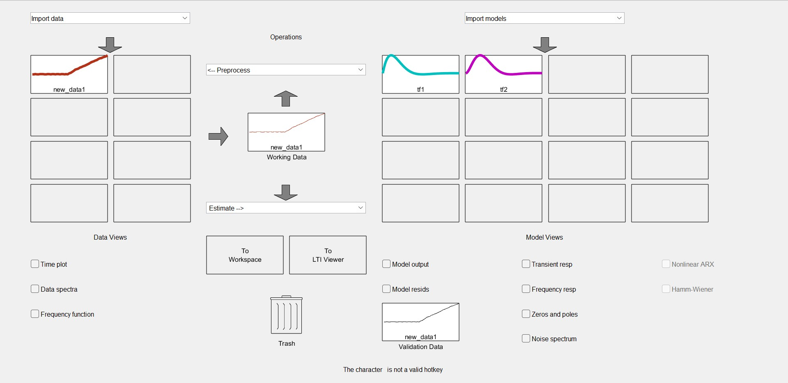
  <p><em>Figure 1: Importing data into the System Identification Toolbox and estimating two transfer function models..</em></p>
</div>

<div align="center">
  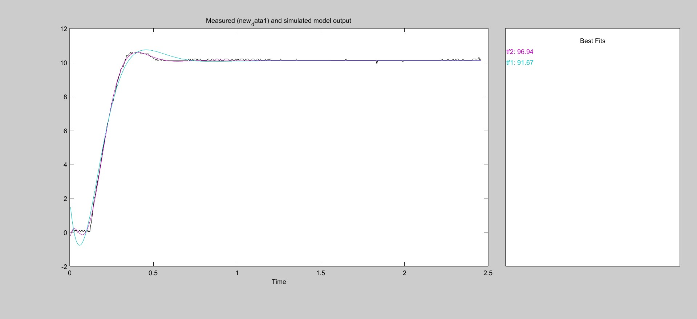
  <p><em>Figure 2: Model Output.</em></p>
</div>

<div align="center">
  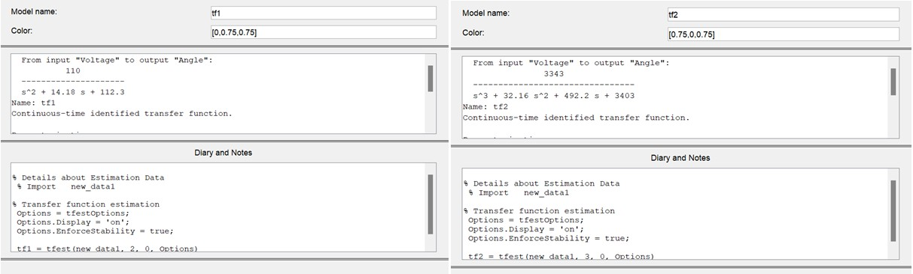
  <p><em>Figure 3: Transfer functions tf1 and tf2.</em></p>
</div>

### 1.4. Evaluation
Once the System Identification GUI was launched, we estimated and evaluated two different transfer functions:

* **Model `tf1` (0 zeros / 2 poles):** This model achieved a **91.67%** fit. While this can be considered a good result, we wanted to explore if the estimation could be further optimized.
* **Model `tf2` (1 zero / 3 poles):** We continued the estimation process by increasing the system order. This model achieved a much higher accuracy with a **96.94%** fit. 

**Conclusion:** Based on these results, the team decided to choose `tf2` as the final plant transfer function.

### 1.5. Plant Transfer Function
Based on the `tf2` estimation, the continuous-time mathematical model of the plant is defined as:

$$ G_{tf2}(s) = G_o(s) = \frac{3343}{s^3 + 36.16s^2 + 492.2s + 3403} $$

## 2. Baseline PI Controller Design
To establish a baseline performance metric and justify the need for an adaptive approach, a standard PI controller was first designed, simulated, and deployed on hardware.

<div align="center">
  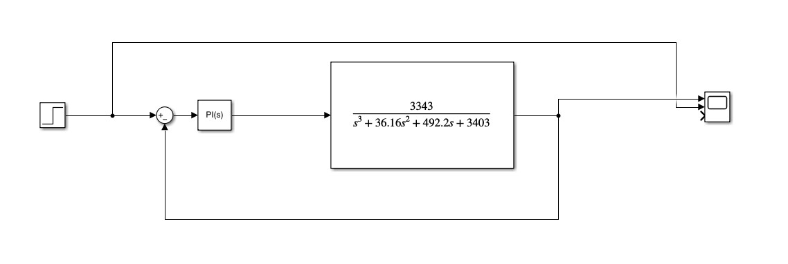
  <p><em>Figure 4: Simulink block diagram of the system using the PI Controller.</em></p>
</div>

### 2.1. PI Parameter Tuning
Using the **MATLAB PID Tuner** application, the controller parameters were optimized specifically for the nominal transfer function of the plant.

**Tuned Parameters:**
* **$K_p$ (Proportional Gain):** `0.702`
* **$K_i$ (Integral Gain):** `6.356`

<div align="center">
  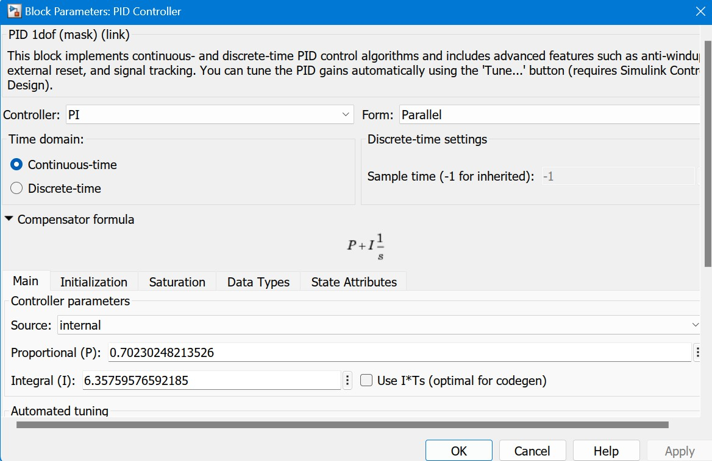
  <p><em>Figure 5: Parameters of the PI Controller.</em></p>
</div>

<div align="center">
  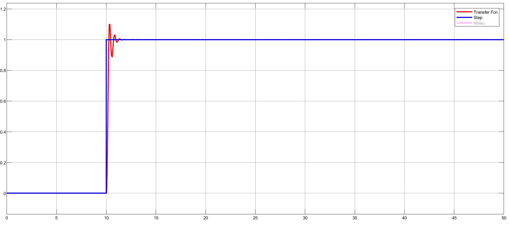
  <p><em>Figure 6: Step response of the PI Controller.</em></p>
</div>

### 2.2. Simulation in MATLAB Simulink with Plant Variation
While the tuned PI controller performs well under nominal conditions, its robustness must be evaluated when the physical system changes. To observe the output response quality under such disturbances, a parameter variation is introduced to the plant model at $t = 20\text{s}$. The system is then simulated again using the same fixed PI controller:

<div align="center">
  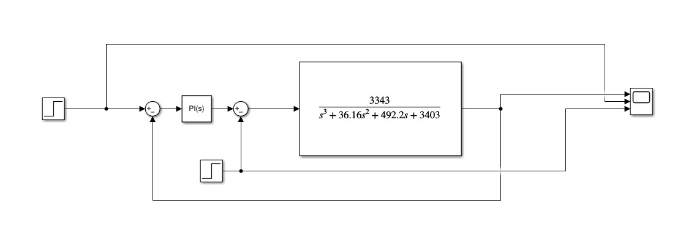
  <p><em>Figure 7: Simulink block diagram of the PI control system with a dynamically changing plant.</em></p>
</div>

<div align="center">
  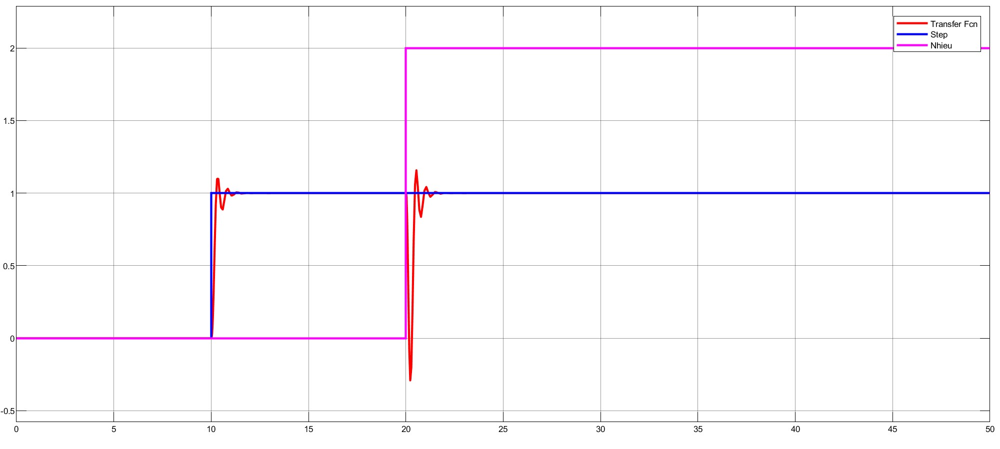
  <p><em>Figure 8: Simulation results showing system degradation (high overshoot) after the plant change at 20s.</em></p>
</div>

**Observation:**
The PI controller only performs well with the original plant using the $K_p$ and $K_i$ parameters specifically calculated for that exact system. When the plant is altered by external factors (as seen at $t = 20\text{s}$), the fixed-gain controller can no longer provide the desired control quality, resulting in high overshoot and instability. 

**Conclusion:**
Therefore, it is necessary to implement **Adaptive Control**. By autonomously updating the controller's parameters in real-time, the system can respond better and maintain absolute stability even when the plant changes continuously. This serves as the primary motivation for developing the **Model Reference Adaptive Controller (MRAC)** in the next chapter.

### 2.3. PID Controller Validation on STM32 Hardware

To validate the theoretical and simulation results, the discrete PI control algorithm was implemented and deployed on the **STM32F103** microcontroller. The execution logic of the firmware and the internal PI computation are illustrated in the flowcharts below:


<div align="center">
  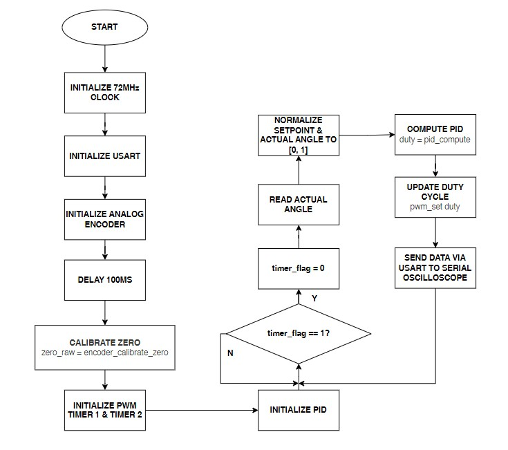
  <p><em>Figure 9: Main algorithm of PI Controller implemented on STM32.</em></p>
</div>

<div align="center">
  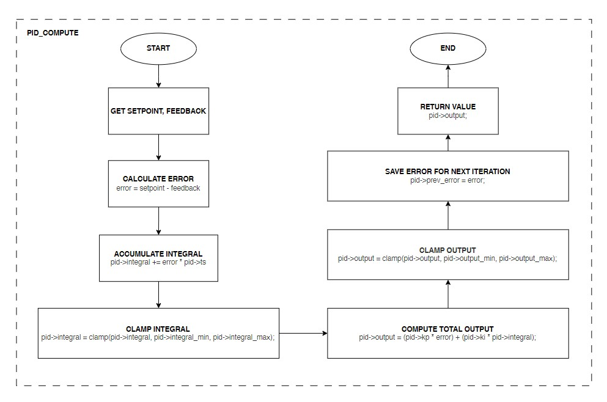
  <p><em>Figure 10: Internal computation algorithm of the PI Controller.</em></p>
</div>

<div align="center">
  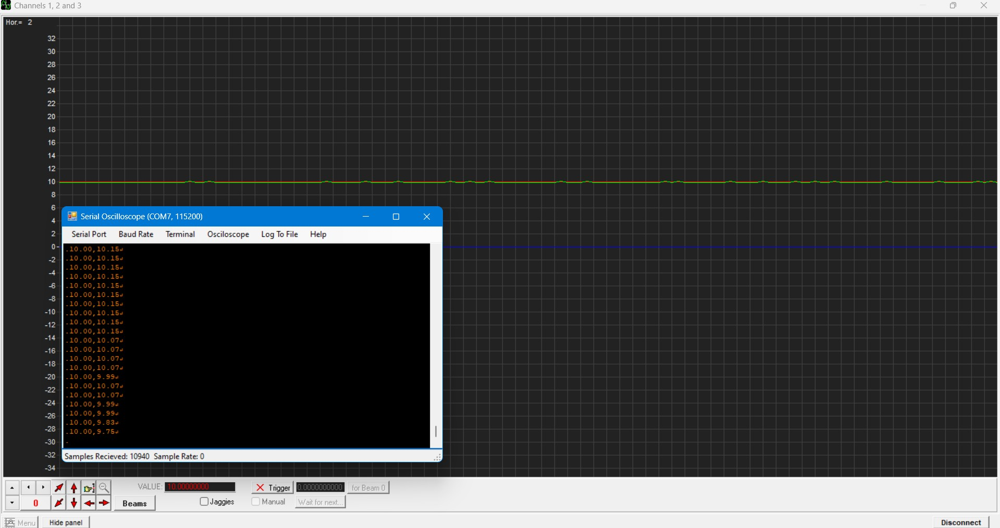
  <p><em>Figure 11: Hardware experimental response of the PI Controller measured via Serial Oscilloscope.</em></p>
</div>

## 3. Model Reference Adaptive Control (MRAC)

To overcome the limitations of the fixed-gain PI controller discussed in Section 2, a Model Reference Adaptive Controller (MRAC) was designed using the **MIT Rule**. The primary objective is to force the unknown or dynamically changing physical plant to track a predefined ideal reference model.

### 3.1 Reference Model & Adaptation Law

The reference model $G_m(s)$ was constructed based on the closed-loop transfer function of the nominal plant combined with the initially tuned PI controller.

$$ G_m(s) = \frac{2347s + 21248}{s^4 + 36.16s^3 + 492.2s^2 + 5750s + 21248} $$

Using the MIT Rule, the cost function $J(\theta) = \frac{1}{2}e^2$ is minimized (where $e$ is the error between the actual output and the reference model's output). The continuous-time update laws for the controller parameters ($K_p$ and $K_i$) are derived using the sensitivity derivatives:

$$ \frac{dK_P}{dt} = -\gamma_P \cdot e \cdot \left[ \frac{3343s}{s^4 + 36.16s^3 + 492.2s^2 + 5750s + 21248} \right] (u_c - y) $$

$$ \frac{dK_I}{dt} = -\gamma_I \cdot e \cdot \left[ \frac{3343}{s^4 + 36.16s^3 + 492.2s^2 + 5750s + 21248} \right] (u_c - y) $$

The adaptation gains were chosen as $\gamma_P = 0.52$ and $\gamma_I = 0.25$ to balance learning speed and system stability.

### 3.2. MRAC Simulation in the Continuous-Time Domain

<div align="center">
  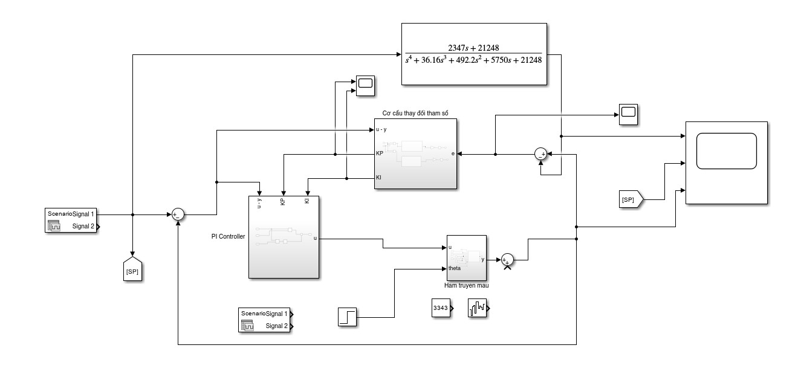
  <p><em>Figure 12: Simulink block diagram of the MRAC system using the MIT Rule.</em></p>
</div>

<div align="center">
  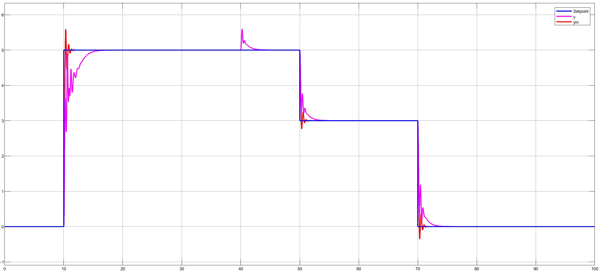
  <p><em>Figure 13: Step response of the continuous-time MRAC system using the MIT Rule with plant variations.</em></p>
</div>

<div align="center">
  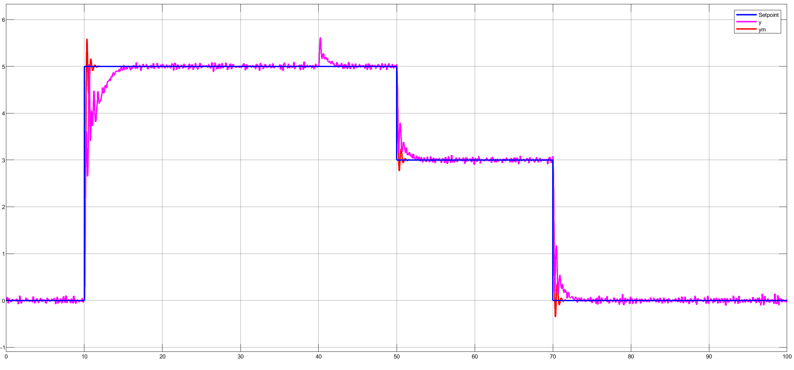
  <p><em>Figure 14: Response of the continuous-time MRAC system using the MIT Rule under plant variation with added white noise.</em></p>
</div>

**Observation:**
After altering the transfer function model of the plant, the system using the PID controller failed to achieve the desired control performance required by the specifications, whereas the adaptive controller successfully met the expected performance. At $t = 40\text{s}$, when $\theta$ changes, the system still responds rapidly. Furthermore, after injecting white noise with arbitrary amplitudes every $5\text{s}$, it can be observed that the system quickly reacts and drives the output state back to the desired value.

### 3.3. MRAC Simulation in the Discrete-Time Domain

To implement the system in a digital microcontroller, the continuous-time transfer functions must be discretized using the Zero-Order Hold (ZOH) method with a sampling time of $T_s = 0.005\text{s}$. The discretization script in MATLAB is implemented as follows:

```matlab
clear; clc;
% Parameters
Ts = 0.005;
s = tf('s');

% Gm_s = (2347*s + 21248) / (s^4 + 36.16*s^3 + 492.2*s^2 + 5750*s + 21248);
Gm_s = 3343 / (s^3 + 36.16*s^2 + 492.2*s + 3403);

% ZOH Discretization
Gm_z = c2d(Gm_s, Ts, 'zoh');

% Display the Discrete-Time Transfer Function
Gm_z
```
After running the script, the discretized plant and reference models are obtained in the z-domain:

Discrete Plant Transfer Function:

$$
\frac{0.000066567742541861z^2 + 0.000254502975927928z + 0.000060814057842816}
{z^3 - 2.823156826217822z^2 + 2.658147827500715z - 0.834602262457349}
$$

Discrete Reference Model ($G_{mz}$):

$$
\frac{0.000047268397404582z^3 + 0.000137605066600752z^2 - 0.000130520593277091z - 0.000042216634893569}
{z^4 - 3.823016619290077z^3 + 5.481304666450856z^2 - 3.492878173382291z + 0.834602262457346}
$$

Continuing to discretize the MIT adaptation law for Kp and Ki respectively:

Discretized Adaptation Law for $K_p$:

$$ \frac{0.00006657z^3 + 0.0001879z^2 - 0.0001937z - 0.00006081}{z^4 - 3.823016619290077z^3 + 5.481304666450856z^2 - 3.492878173382291z + 0.834602262457346} $$


Discretized Adaptation Law for $K_i$:

$$ \frac{0.00000008397z^3 + 0.0000008909z^2 + 0.0000008592z + 0.00000007534}{z^4 - 3.823016619290077z^3 + 5.481304666450856z^2 - 3.492878173382291z + 0.834602262457346} $$


<div align="center">
  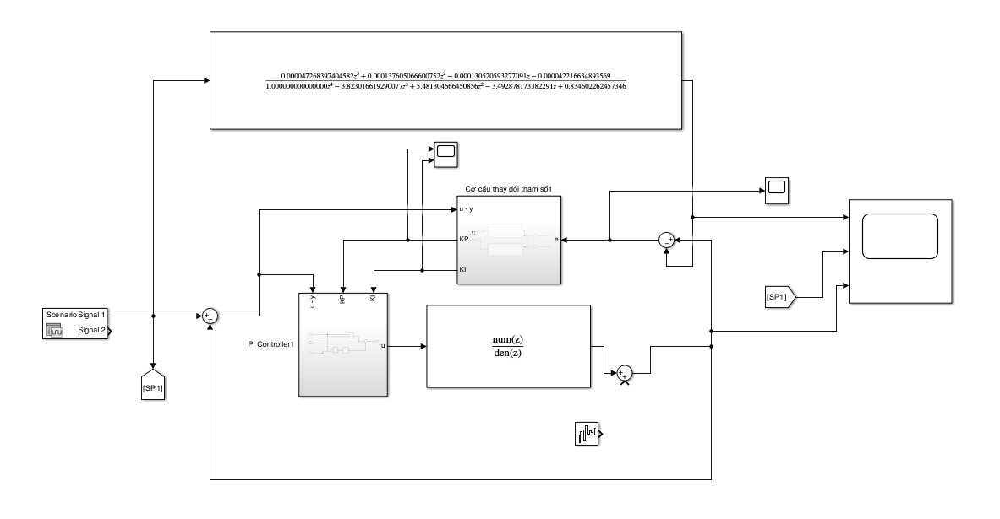
  <p><em>Figure 15: Simulink block diagram of the MRAC system using the MIT Rule in Discrete-Time Domain.</em></p>
</div>

<div align="center">
  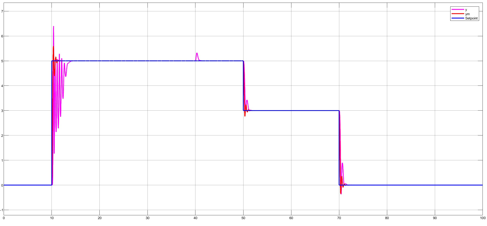
  <p><em>Figure 16: Step response of the discrete-time MRAC system using the MIT Rule with plant variations.</em></p>
</div>

<div align="center">
  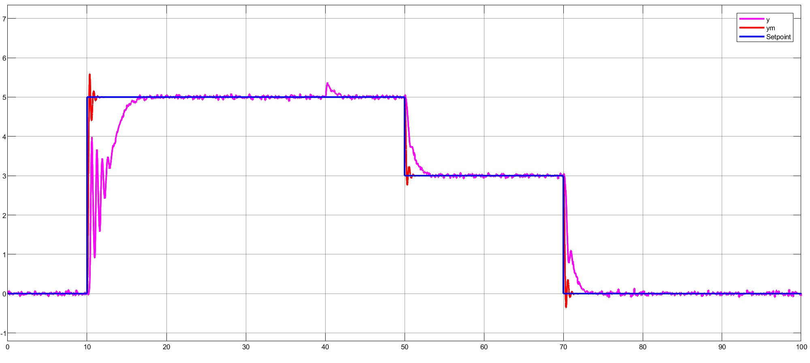
  <p><em>Figure 17: Response of the discrete-time MRAC system using the MIT Rule under plant variation with added white noise.</em></p>
</div>

**Observation:**
Compared to the continuous-time system, at $t = 10\text{s}$, the output signal $y$ exhibits extremely strong oscillatory behavior before tracking the setpoint. These amplitudes fluctuate back and forth continuously and require significantly more time to suppress. At $t = 40\text{s}$, when $\theta$ changes, the system still responds rapidly. The primary reason for this behavior is the introduction of the sampling period and the Zero-Order Hold (ZOH) element in the discrete system. Consequently, given the same plant and MIT update law, the discrete system is inherently less stable than the continuous system and prone to transient oscillations during sudden parameter shifts.

Furthermore, when white noise is injected, the response fluctuates more intensely than in the continuous counterpart. Although the system does not lose complete stability (still tracking the average value), the combination of noise and sampling-induced oscillation causes noticeable agitation in the output signal.

### 3.4. MRAC Controller Validation on STM32 Hardware

To validate the theoretical and simulation results in a real-world environment, the discrete MRAC algorithm based on the MIT Rule was deployed on the **STM32F103** microcontroller. The execution architecture of the firmware and the internal adaptation computation logic are illustrated in the flowcharts below.

<div align="center">
  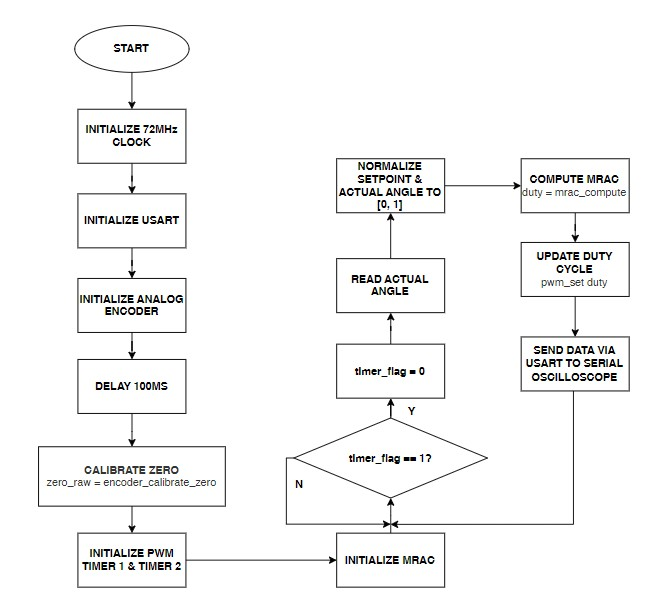
  <p><em>Figure 18: Main algorithm of MRAC Controller implemented on STM32.</em></p>
</div>

<div align="center">
  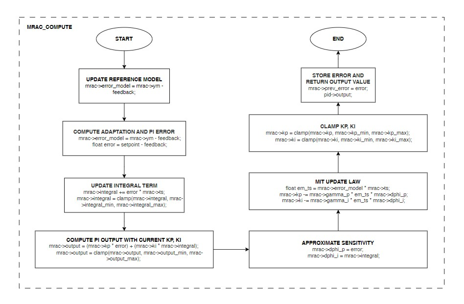
  <p><em>Figure 19: Internal computation algorithm of the MRAC Controller.</em></p>
</div>

<div align="center">
  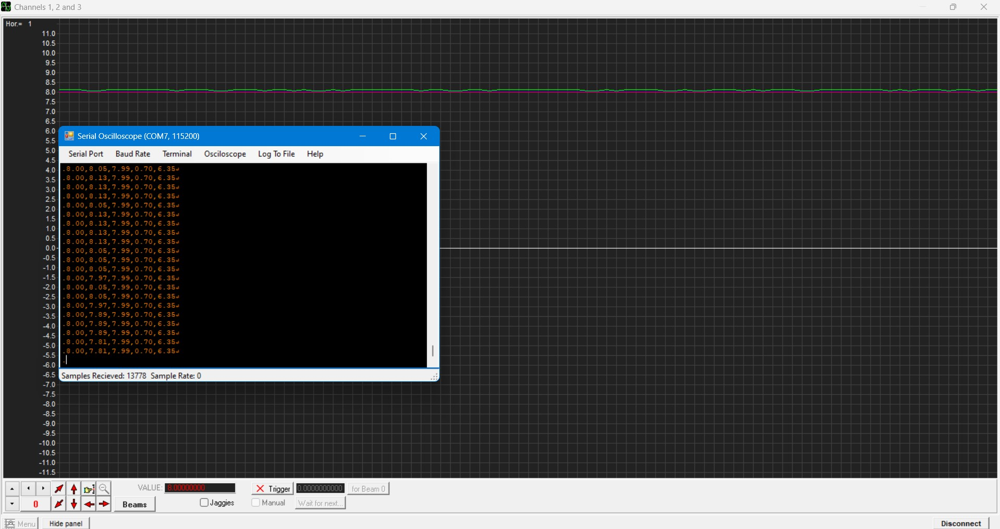
  <p><em>Figure 20: Hardware experimental response of the MRAC Controller measured via Serial Oscilloscope.</em></p>
</div>

## Project Structure

```
FINAL_PROJECT_ADAPTIVE_CONTROL/
├── Img/                           # Image for README 
│
├── MRAC/                          # Keil Project for the MRAC Controller
│   ├── MRAC/                      # Main source code directory for MRAC
│   │   ├── Inc/                   # Header files
│   │   │   ├── delay.h
│   │   │   ├── encoder_analog.h
│   │   │   ├── gpio_driver.h
│   │   │   ├── mrac_controller.h
│   │   │   └── usart_driver.h
│   │   └── Src/                   # Source files
│   │       ├── delay.c
│   │       ├── encoder_analog.c
│   │       ├── gpio_driver.c
│   │       ├── main.c
│   │       ├── mrac_controller.c
│   │       └── usart_driver.c
│   ├── MRAC.uvprojx               # Main Keil uVision Project File
│   ├── MRAC.uvoptx                # Target and Debugger settings
│
├── PID/                           # Keil Project for the Baseline PI Controller
│   ├── PID/                       # Main source code directory for PID
│   │   ├── Inc/                   # Header files
│   │   │   ├── delay.h
│   │   │   ├── encoder_analog.h
│   │   │   ├── gpio_driver.h
│   │   │   ├── pi_controller.h
│   │   │   └── usart_driver.h
│   │   └── Src/                   # Source files
│   │       ├── delay.c
│   │       ├── encoder_analog.c
│   │       ├── gpio_driver.c
│   │       ├── main.c
│   │       ├── pi_controller.c
│   │       └── usart_driver.c
│   ├── PID.uvprojx                # Main Keil uVision Project File
│   └── PID.uvoptx                 # Target and Debugger settings
├── MATLAB/
│   ├── DKTN_CKI.slx               # Simulink model (continuous domain)
│   ├── DKTN_MRAC_MIENROIRAC.slx   # Simulink model (discrete domain)
│   ├── nhandangdoituong.m         # MATLAB script for system identification
│   └── roirachoahambac4.m         # MATLAB script for discrete-time ZOH conversion
├── csv_serial.py                  # Python script for reading serial data from STM32 and saving to CSV
├── dataset.csv                    # Experimental dataset collected from the Fan-and-Plate system
├── .gitignore
└── README.md                      # Project documentation
```